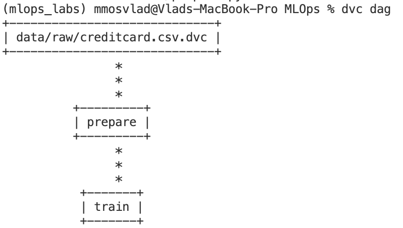

# Лабораторна робота №2. Версіонування даних та побудова пайплайнів (DVC)

## 1. Мета роботи

1. Опанувати інструмент DVC (Data Version Control) для управління версіями великих файлів даних.
2. Навчитися розділяти версіонування коду (Git) та даних (DVC).
3. Спроектувати та реалізувати відтворюваний ML-пайплайн (Pipeline), що складається з етапів підготовки даних та навчання моделі.
4. Засвоїти принципи роботи з DAG (Directed Acyclic Graph) у контексті виконання ML-задач.

## 2. Виконані завдання

1. ✅ Встановлено та ініціалізовано DVC у проєкті, створеному в Лабораторній роботі №1.
2. ✅ Налаштовано локальне віддалене сховище (Local Remote) для імітації хмарного сховища (S3/Google Drive).
3. ✅ Додано файл сирих даних (`data/raw/creditcard.csv`) під контроль DVC.
4. ✅ Виконано рефакторинг коду: розділено монолітний `train.py` на два етапи — `src/prepare.py` (підготовка даних) та `src/train.py` (навчання моделі).
5. ✅ Описано пайплайн у файлі `dvc.yaml`, визначено входи (dependencies) та виходи (outputs) для кожного етапу.
6. ✅ Запущено виконання пайплайну командою `dvc repro`.
7. ✅ Продемонстровано роботу механізму кешування DVC: при зміні параметрів або даних виконуються лише необхідні кроки.

## 3. Рефакторинг: prepare та train

**`src/prepare.py`** — підготовка даних:

- Вхід: `data/raw/creditcard.csv` (сирі дані під DVC)
- Дії: очистка (дублікати, пропуски), feature engineering (Time → hour_of_day, Amount → RobustScaler), розділення на train/test
- Вихід: `data/prepared/train.csv`, `data/prepared/test.csv`

**`src/train.py`** — навчання моделі:

- Вхід: підготовлені дані
- Дії: навчання XGBoost, логування в MLflow, збереження моделі
- Вихід: модель у `data/models/`, артефакти в MLflow

## 4. DVC Pipeline

Пайплайн складається з двох етапів, пов'язаних DAG-залежностями:

- **prepare** — залежить від сирих даних та скрипта; створює підготовлені train/test файли
- **train** — залежить від виходів prepare та скрипта; створює модель

Використано найкращі гіперпараметри з аналізу Lab 1: `n_estimators=100`, `max_depth=10`, `learning_rate=0.1`.

### Скріншот DAG пайплайну

*Скріншот `dvc dag`: граф залежностей етапів prepare → train.*

## 5. Кешування DVC

При повторному запуску `dvc repro` DVC перевіряє зміни в deps та outs. Якщо входи не змінилися і виходи вже існують, етап пропускається. При зміні, наприклад, гіперпараметрів у `dvc.yaml` перезапускається лише етап `train`; при зміні сирих даних — спочатку `prepare`, потім `train`.

## 6. Висновки

У межах лабораторної роботи інтегровано DVC для версіонування даних та опису ML-пайплайну. Реалізовано розділення коду на етапи підготовки та навчання з явними залежностями у `dvc.yaml`. Локальне remote-сховище імітує роботу з хмарою. Механізм кешування DVC забезпечує повторне виконання лише змінених етапів, що пришвидшує ітерації в ML-проєктах.
