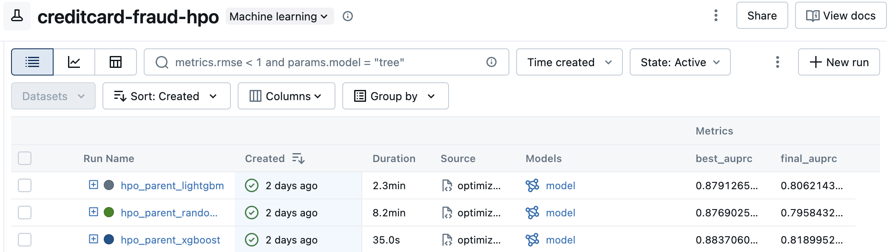
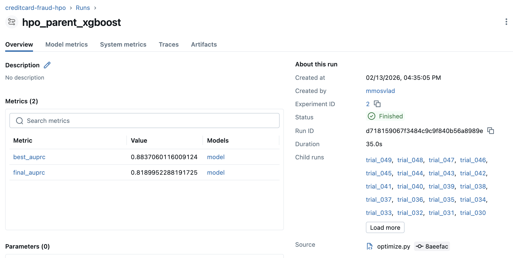

# Лабораторна робота №3. Гіперпараметрична оптимізація та оркестрація ML-пайплайнів з Optuna

## 1. Мета роботи

1. Пояснити різницю між параметрами моделі та гіперпараметрами.
2. Спроєктувати простір пошуку (search space) і обґрунтувати його межі.
3. Реалізувати objective function для Optuna та коректно оцінювати модель на validation наборі.
4. Організувати експеримент як відтворюваний пайплайн (конфігурація + код + артефакти).
5. Логувати експерименти в MLflow з використанням nested runs (parent run = study, child run = trial).
6. Інтерпретувати результати HPO і зробити висновок про компроміс якість ↔ час/ресурси.

## 2. Виконані завдання

1. ✅ Встановлено та налаштовано Optuna у віртуальному середовищі.
2. ✅ Реалізовано objective function у `src/optimize.py`.
3. ✅ Описано простір пошуку гіперпараметрів для XGBoost, Random Forest та LightGBM у `config/config.yaml`.
4. ✅ Створено Study та запущено оптимізацію (≥20 trials).
5. ✅ Кожен trial логовано в MLflow як nested run усередині parent run.
6. ✅ Визначено найкращі гіперпараметри, перетреновано модель та залоговано фінальну модель як артефакт.
7. ✅ Додано Hydra-конфігурацію (YAML) для параметризації пайплайна.

## 3. Структура проєкту

```
config/
├── config.yaml         # базова конфігурація, search space
├── model/
│   ├── xgboost.yaml
│   ├── random_forest.yaml
│   └── lightgbm.yaml
└── hpo/
    ├── tpe.yaml
    └── random.yaml
src/
├── prepare.py
├── train.py
└── optimize.py         # HPO + Optuna + MLflow + Hydra
```

## 4. Search Space

**XGBoost:** n_estimators, max_depth, learning_rate (log), subsample, colsample_bytree, reg_alpha, reg_lambda (log), min_child_weight.

**Random Forest:** n_estimators, max_depth, min_samples_split, min_samples_leaf.

**LightGBM:** n_estimators, max_depth, learning_rate (log), num_leaves, subsample, reg_alpha (log).

Межі обґрунтовані документацією бібліотек та попередніми експериментами (Lab 1–2).

## 5. Запуск HPO

```bash
# Одна модель (XGBoost + TPE, 20 trials)
python -m src.optimize

# Всі три моделі по 50 trials кожна (run_name: hpo_parent_xgboost, hpo_parent_random_forest, hpo_parent_lightgbm)
python -m src.optimize hpo.run_all_models=true
# або
./run_hpo_all_models.sh

# XGBoost + Random sampler
python -m src.optimize hpo=random

# Random Forest + TPE
python -m src.optimize model=random_forest

# LightGBM + 30 trials
python -m src.optimize model=lightgbm hpo.n_trials=30
```

Перед запуском: MLflow server на порту 5000 (`mlflow ui --port 5000`), підготовлені дані (`dvc repro` або `python -m src.prepare`).

## 6. MLflow Nested Runs

- **Parent run** (hpo_parent) — контейнер оптимізації; логуються config, best_params, best_auprc, final модель.
- **Child runs** (trial_000, trial_001, …) — окремі trials з params та metric auprc.





## 7. Порівняння моделей (50 trials на модель)

| Модель | Best val AUPRC | Final test AUPRC | Час |
|--------|----------------|------------------|-----|
| XGBoost | 0.884 | 0.819 | 35 с |
| Random Forest | 0.877 | 0.796 | 8.2 хв |
| LightGBM | 0.879 | 0.806 | 2.3 хв |

**Найкращі гіперпараметри (best_params.json):**

- **XGBoost:** n_estimators=162, max_depth=8, learning_rate≈0.042, subsample≈0.83, colsample_bytree≈0.72, reg_alpha≈1e-5, reg_lambda≈0.0005, min_child_weight=1  
- **Random Forest:** n_estimators=204, max_depth=19, min_samples_split=4, min_samples_leaf=1  
- **LightGBM:** n_estimators=221, max_depth=9, learning_rate≈0.0026, num_leaves=109, subsample≈0.73, reg_alpha≈8e-5  

## 8. Порівняння Sampler-ів (TPE vs Random)

XGBoost, n_trials=20. Результати подібні — обидва samplers знайшли однакові метрики:

| Sampler | Best val AUPRC | Final test AUPRC |
|---------|----------------|------------------|
| TPE | 0.878 | 0.831 |
| Random | 0.878 | 0.831 |

## 9. Відтворюваність

- Seed фіксовано в конфігурації (`seed: 42`).
- Optuna sampler отримує той самий seed.
- Конфігурація зберігається в MLflow як артефакт `config_resolved.json`.

## 10. Висновки

У межах лабораторної роботи інтегровано Optuna для гіперпараметричної оптимізації та Hydra для керування конфігурацією. Реалізовано objective function з підтримкою XGBoost, Random Forest та LightGBM. Експерименти логуються в MLflow у вигляді nested runs (parent = study, child = trials), що спрощує аналіз та порівняння. Hydra дозволяє перемикати модель, sampler та інші параметри без зміни коду.

**Результати:** XGBoost показав найвищий final test AUPRC (0.819) при найменшому часі (35 с). Random Forest — найповільніший (8.2 хв) і нижчий test AUPRC (0.796). LightGBM — компроміс: 0.806 AUPRC за 2.3 хв. TPE та Random sampler дали подібні результати при n_trials=20.
