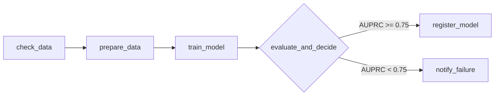

# Лабораторна робота №5. Оркестрація ML-пайплайнів: Від CI/CD до Continuous Training

## 1. Мета роботи

1. Зрозуміти принципи оркестрації ML-пайплайнів за допомогою Apache Airflow.
2. Навчитися контейнеризувати ML-застосунки за допомогою Docker (multi-stage build).
3. Налаштувати повноцінне локальне середовище для ML-оркестрації: Airflow + MLflow + PostgreSQL.
4. Реалізувати DAG (Directed Acyclic Graph) для автоматизованого навчання моделі з логікою розгалуження (BranchPythonOperator).
5. Інтегрувати MLflow Model Registry для реєстрації та версіонування моделей.

## 2. Виконані завдання

- ✅ Dockerfile (multi-stage build: builder + runtime)
- ✅ `.dockerignore`
- ✅ `docker-compose.yaml` (Airflow + MLflow + PostgreSQL)
- ✅ Airflow DAG `ml_training_pipeline` (5 tasks + branching)
- ✅ DAG integrity tests (`tests/test_dag.py`)
- ✅ GitHub Actions CI workflow (`ci.yaml`: lint + dag-test + docker-build)
- ✅ README (цей документ)

## 3. Структура проєкту

```
MLOps/
├── Dockerfile                          # Multi-stage Docker build
├── .dockerignore                       # Виключення для Docker
├── docker-compose.yaml                 # Airflow + MLflow + Postgres
├── dags/
│   └── ml_training_pipeline.py         # Airflow DAG (5 tasks + branching)
├── src/
│   ├── prepare.py                      # Підготовка даних (Click CLI)
│   ├── train.py                        # Навчання моделі (Click CLI)
│   └── optimize.py                     # HPO (Optuna + Hydra)
├── tests/
│   ├── test_dag.py                     # DAG integrity tests (новий)
│   ├── test_pre_train.py               # Перевірка даних
│   └── test_post_train.py              # Quality gate тести
├── config/                             # Hydra конфігурації
├── data/                               # Дані (DVC-tracked)
├── .github/workflows/
│   ├── ci.yaml                         # Lab5 CI (lint + dag-test + docker-build)
│   └── cml.yaml                        # Lab4 CML workflow
└── requirements.txt
```

## 4. Контейнеризація (Docker)

### Dockerfile — Multi-stage build

**Stage 1 (builder):** базовий образ `python:3.11` з компіляторами.
- Встановлює всі залежності з `requirements.txt` (включно з xgboost, lightgbm).

**Stage 2 (runtime):** `python:3.11-slim` — мінімальний образ.
- Копіює встановлені пакети зі stage 1 (`site-packages`, `bin`).
- Копіює вихідний код: `src/`, `config/`, `dvc.yaml`, `dvc.lock`.
- `PYTHONPATH=/app` — дозволяє запускати `python -m src.prepare`, `python -m src.train`.

### Переваги multi-stage:
- Builder-образ (~2 GB) залишається лише як проміжний.
- Runtime-образ значно менший (~500 MB), без компіляторів і build-tools.

### .dockerignore
Виключає: `.git`, `mlruns/`, `__pycache__`, `*.pyc`, `.venv`, `artifacts/`, `*.egg-info`, підготовлені дані.

## 5. Оркестрація (Apache Airflow)

### Сервіси docker-compose.yaml

| Сервіс | Образ | Порт | Призначення |
|--------|-------|------|-------------|
| `postgres` | `postgres:13` | — | Metadata DB для Airflow |
| `airflow-init` | `apache/airflow:2.10.4-python3.11` | — | One-shot ініціалізація DB + admin user |
| `airflow-webserver` | `apache/airflow:2.10.4-python3.11` | 8080 | Web UI |
| `airflow-scheduler` | `apache/airflow:2.10.4-python3.11` | — | Планувальник DAGs |
| `mlflow` | `python:3.11-slim` | 5001 | Tracking server + Model Registry |

### Архітектура
```
┌──────────────┐    metadata    ┌──────────────┐
│  Webserver   │◄──────────────►│  PostgreSQL  │
│  :8080       │                └──────────────┘
└──────────────┘
        ▲
        │ shared volumes
        ▼
┌──────────────┐    experiments ┌──────────────┐
│  Scheduler   │───────────────►│   MLflow     │
│  (runs DAGs) │                │   :5000      │
└──────────────┘                └──────────────┘
```

### ML-залежності в Airflow
Встановлюються через `_PIP_ADDITIONAL_REQUIREMENTS`:
`scikit-learn==1.5.2`, `xgboost==2.1.4`, `lightgbm==4.5.0`, `pandas`, `numpy`, `mlflow`, `kagglehub`, `joblib`, `seaborn`, `matplotlib`.

## 6. DAG: ml_training_pipeline

### Діаграма


```mermaid
graph LR
    A[check_data] --> B[prepare_data]
    B --> C[train_model]
    C --> D{evaluate_and_decide}
    D -->|AUPRC >= 0.75| E[register_model]
    D -->|AUPRC < 0.75| F[notify_failure]
```

### Опис tasks

| Task | Тип | Призначення |
|------|-----|-------------|
| `check_data` | PythonOperator | Перевірка наявності `creditcard.csv`; завантаження через kagglehub якщо відсутній; XCom push шляху до файлу |
| `prepare_data` | BashOperator | `python -m src.prepare` — очищення, feature engineering, train/test split |
| `train_model` | BashOperator | `python -m src.train` — навчання XGBoost, збереження `model.pkl` та `metrics.json` |
| `evaluate_and_decide` | BranchPythonOperator | Читає `metrics.json`, перевіряє `test_auprc >= 0.75`; XCom push метрик |
| `register_model` | PythonOperator | Реєстрація в MLflow як `creditcard-fraud-detector` (experiment: `creditcard-fraud-production`) |
| `notify_failure` | PythonOperator | Логування попередження з фактичними метриками та порогом |

### BranchPythonOperator логіка
```python
if test_auprc >= 0.75:
    return 'register_model'
else:
    return 'notify_failure'
```

### XCom для передачі метрик
- `check_data` → пушить `data_path`
- `evaluate_and_decide` → пушить повний словник `metrics`
- `register_model` → читає `metrics` через `xcom_pull`

## 7. CI/CD (GitHub Actions)

### Workflow: `.github/workflows/ci.yaml`

**Тригери:** push/PR на `lab5` та `main`.

#### Job: `lint`
- `flake8 src/ tests/ dags/` — перевірка критичних помилок (E9, F63, F7, F82)
- `black src/ tests/ dags/ --check` — перевірка форматування

#### Job: `dag-test`
- Встановлює `apache-airflow==2.10.4` + залежності проєкту
- Ініціалізує SQLite Airflow DB
- Запускає `pytest tests/test_dag.py -v` — перевірка цілісності DAG

#### Job: `docker-build`
- Будує Docker образ: `docker build -t mlops-lab5 .`
- Перевіряє імпорти: `docker run --rm mlops-lab5 python -c "import sklearn; import xgboost; import mlflow; print('OK')"`

## 8. MLflow Model Registry

Модель реєструється в задачі `register_model`:
- **Experiment:** `creditcard-fraud-production`
- **Registered model name:** `creditcard-fraud-detector`
- Логуються параметри навчання (model_type, n_estimators, max_depth, learning_rate)
- Логуються всі метрики з quality gate evaluation
- Використовується `mlflow.sklearn.log_model()` з `registered_model_name`

## 9. Як запустити

### Локально (Docker Compose):
```bash
# Запустити всі сервіси
docker-compose up -d

# Відкрити Airflow UI
# http://localhost:8080  (login: airflow / airflow)

# Відкрити MLflow UI
# http://localhost:5001

# Вручну запустити DAG через Airflow UI:
# DAGs → ml_training_pipeline → Trigger DAG ▶
```

### Зупинка:
```bash
docker-compose down
# Видалити volumes (якщо потрібно скинути стан):
docker-compose down -v
```

### Без Docker (локальний запуск pipeline):
```bash
python -m src.prepare --input data/raw/creditcard.csv --output-dir data/prepared
python -m src.train --model xgboost --n-estimators 100 --max-depth 10 \
    --learning-rate 0.1 --model-dir data/models
```

## 10. Скріншоти

### DAG Graph (Mermaid)

```mermaid
graph LR
    A[check_data] --> B[prepare_data]
    B --> C[train_model]
    C --> D{evaluate_and_decide}
    D -->|AUPRC >= 0.75| E[register_model]
    D -->|AUPRC < 0.75| F[notify_failure]
```

*Після запуску `docker-compose up -d` та відкриття http://localhost:8080 → DAGs → ml_training_pipeline → Graph View можна переглянути живий граф DAG.*

*MLflow Model Registry доступний за адресою http://localhost:5001 → Models → creditcard-fraud-detector після успішного запуску DAG.*

## 11. Висновки

У цій лабораторній роботі реалізовано повноцінну систему оркестрації ML-пайплайнів:

1. **Контейнеризація** — multi-stage Dockerfile зменшує розмір runtime-образу, виключаючи компілятори та build-tools.
2. **Оркестрація** — Apache Airflow з LocalExecutor та PostgreSQL як metadata DB забезпечує надійне виконання DAGs.
3. **Розгалуження** — BranchPythonOperator реалізує Quality Gate: модель реєструється лише якщо `test_auprc >= 0.75`, інакше — сповіщення про помилку.
4. **MLflow Model Registry** — централізоване версіонування моделей з автоматичною реєстрацією через Airflow.
5. **CI/CD** — трьохступеневий pipeline (lint → dag-test → docker-build) забезпечує якість коду та інфраструктури.
